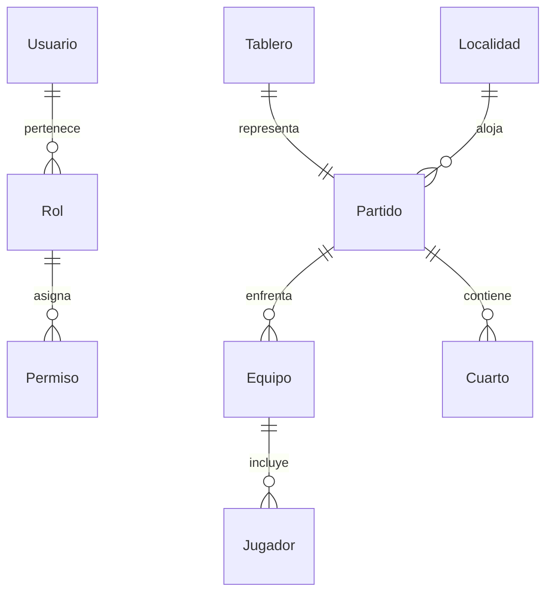

#  Back-Tablero - Documentación Completa

## Descripción General
**Back-Tablero** es una aplicación **backend** desarrollada con **.NET 8 Web API** que gestiona un sistema de **tablero deportivo digital en tiempo real**.  

### Funcionalidades principales
- Autenticación y autorización con roles y permisos.
- Gestión de usuarios y perfiles.
- Administración de equipos y jugadores.
- Creación y seguimiento de partidos.
- Registro de cuartos de juego.
- Tablero de puntuación en tiempo real.
- Orquestación de servicios con **Docker Compose**.
- Persistencia de datos con **SQL Server** + **Entity Framework Core**.

---

##  Estructura del Proyecto

```plaintext
Back-Tablero-main/
│── .gitignore
│── README.MD
│── docker-compose.yml
│── tablero_api.sln
│
├── tablero_api/
│   ├── .dockerignore
│   ├── Docker-compose.yml
│   ├── Dockerfile
│   ├── Dockerfile.migrate
│   ├── tablero_api.csproj
│   ├── Program.cs
│   ├── appsettings.json
│   ├── appsettings.Development.json
│   │
│   ├── Controllers/   # Controladores API
│   │   ├── AuthController.cs
│   │   ├── UsuarioController.cs
│   │   ├── RolController.cs
│   │   ├── PermisoController.cs
│   │   ├── EquipoController.cs
│   │   ├── JugadorController.cs
│   │   ├── PartidoController.cs
│   │   ├── CuartoController.cs
│   │   ├── TableroController.cs
│   │   ├── LocalidadController.cs
│   │   └── ImagenController.cs
│   │
│   ├── Data/
│   │   └── AppDbContext.cs
│   │
│   ├── Migrations/
│   │   ├── 20250824075611_initialCreate.*
│   │   ├── 20250914053154_authmigrate.*
│   │   └── 20250914070710_jugadormigration.*
│   │
│   └── Properties/
```

---

## Requisitos Previos

Antes de ejecutar el proyecto asegúrate de tener instalado:

- [.NET 8 SDK](https://dotnet.microsoft.com/en-us/download/dotnet/8.0)
- [SQL Server 2022](https://www.microsoft.com/es-es/sql-server/sql-server-downloads)
- [Docker Desktop](https://www.docker.com/products/docker-desktop/)
- [Git](https://git-scm.com/)

---

##  Instalación y Ejecución

###  Clonar repositorio
```bash
git clone <url-repo>
cd Back-Tablero-main
```

### Ejecutar con Docker
```bash
docker compose up --build
```

Esto levanta:
- **Backend API (ASP.NET Core 8)**
- **Base de datos SQL Server 2022**

### Ejecutar en local (sin Docker)
```bash
cd tablero_api
dotnet run
```

La API estará disponible en:  
[https://localhost:5001](https://localhost:5001)   [http://localhost:5000](http://localhost:5000)

### 🔹 Aplicar migraciones
```bash
dotnet ef database update
```

---

## Base de Datos

### Entidades principales
- **Usuario**: credenciales, roles, permisos.
- **Rol**: define niveles de acceso.
- **Permiso**: acciones autorizadas.
- **Equipo**: información de equipos deportivos.
- **Jugador**: datos de jugadores.
- **Partido**: encuentros entre equipos.
- **Cuarto**: periodos de juego.
- **Localidad**: zonas físicas (ej. estadios).
- **Tablero**: marcador en vivo.

### Diagrama Entidad-Relación (simplificado)


---

##  API Endpoints

### Autenticación
**Ruta base**: `/api/Auth`

| Método | Endpoint    | Descripción      |
|--------|-------------|-----------------|
| POST   | `/login`    | Iniciar sesión  |
| POST   | `/register` | Registrar usuario |

 **Ejemplo Request Login**
```json
{
  "email": "admin@tablero.com",
  "password": "123456"
}
```

 **Ejemplo Response**
```json
{
  "token": "eyJhbGciOiJIUzI1NiIsInR...",
  "usuario": {
    "id": 1,
    "nombre": "Administrador",
    "rol": "Admin"
  }
}
```

---

###  Usuarios
**Ruta base**: `/api/Usuario`

| Método | Endpoint   | Descripción        |
|--------|------------|-------------------|
| GET    | `/`        | Listar usuarios   |
| GET    | `/{id}`    | Obtener usuario   |
| POST   | `/`        | Crear usuario     |
| PUT    | `/{id}`    | Actualizar usuario |
| DELETE | `/{id}`    | Eliminar usuario  |

---

###  Equipos y Jugadores
**Ruta base**: `/api/Equipo` y `/api/Jugador`

| Método | Endpoint        | Descripción       |
|--------|-----------------|------------------|
| GET    | `/api/Equipo`   | Listar equipos   |
| POST   | `/api/Equipo`   | Crear equipo     |
| GET    | `/api/Jugador`  | Listar jugadores |
| POST   | `/api/Jugador`  | Agregar jugador  |

---

### 🏟️ Partidos y Tablero
**Ruta base**: `/api/Partido` y `/api/Tablero`

| Método | Endpoint        | Descripción        |
|--------|-----------------|-------------------|
| GET    | `/api/Partido`  | Listar partidos   |
| POST   | `/api/Partido`  | Crear partido     |
| GET    | `/api/Tablero`  | Estado del tablero |

---

###  Roles y Permisos
**Ruta base**: `/api/Rol` y `/api/Permiso`

| Método | Endpoint          | Descripción      |
|--------|-------------------|-----------------|
| GET    | `/api/Rol`        | Listar roles    |
| POST   | `/api/Rol`        | Crear rol       |
| GET    | `/api/Permiso`    | Listar permisos |
| POST   | `/api/Permiso`    | Crear permiso   |

---

## 🛠️ Desarrollo

### Crear nueva migración
```bash
dotnet ef migrations add NombreMigracion
```

### Aplicar migración
```bash
dotnet ef database update
```

### Ejecutar pruebas (cuando se integren con xUnit)
```bash
dotnet test
```

---

##  Próximos pasos

-  Integración con **Angular Frontend**  
-  Implementación de pruebas unitarias y de integración  
-  Configuración de despliegue en **IIS / Azure / Docker Swarm**  
-  Documentación con **Swagger** para explorar la API  

---

##  Autores
Proyecto desarrollado en la **Universidad Mariano Gálvez - Ingeniería en Sistemas**  
Equipo: *Tablero Deportivo*
